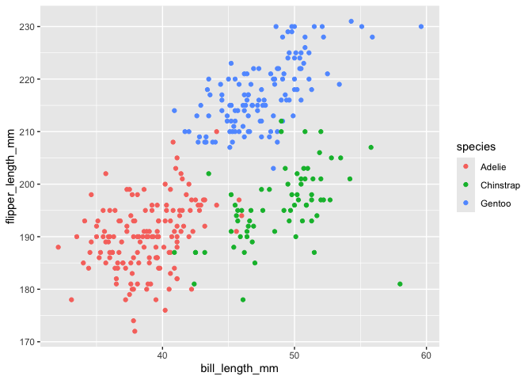

p8105_hw1_yl5505
================
Yan Li
2024-09-21

# Problem 1

## Load the penguins dataset

``` r
data("penguins", package = "palmerpenguins")
```

## Short description of the penguins dataset

The penguins dataset contains observational data, it includes 8
variables:

1.  species: The species of penguins (Adelie, Chinstrap, Gentoo).
2.  island: The island where the penguins were observed (Torgersen,
    Biscoe, Dream).
3.  bill_length_mm: The length of the penguins’ bills in millimeters.
4.  bill_depth_mm: The depth of the penguins’ bills in millimeters.
5.  flipper_length_mm: The length of the penguins’ flippers in
    millimeters.
6.  body_mass_g: The mass of the penguins in grams.
7.  sex: The sex of the penguins (male, female).
8.  year: The year in which the penguin observations were recorded.

The dataset has 344 rows and 8 columns. The mean flipper length across
all penguins in the dataset is 200.9152047 mm.

## Scatterplot of Flipper Length vs Bill Length

``` r
ggplot(penguins, aes(x = bill_length_mm, y = flipper_length_mm, color = species)) +
  geom_point()
```

    ## Warning: Removed 2 rows containing missing values or values outside the scale range
    ## (`geom_point()`).

<!-- -->

# Save the plot

``` r
ggsave("penguin_scatterpplot.pdf")
```

    ## Saving 7 x 5 in image

    ## Warning: Removed 2 rows containing missing values or values outside the scale range
    ## (`geom_point()`).
